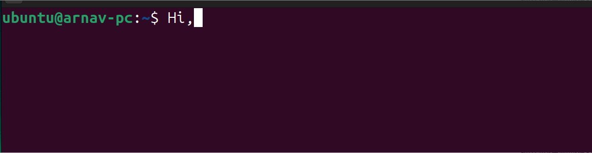
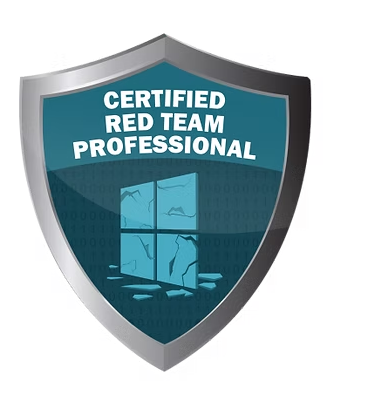
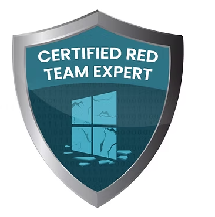
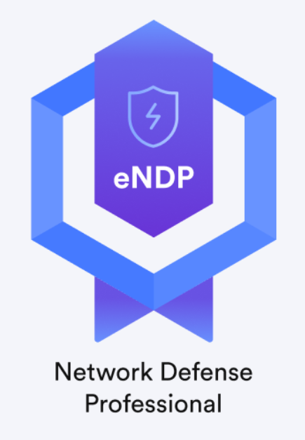
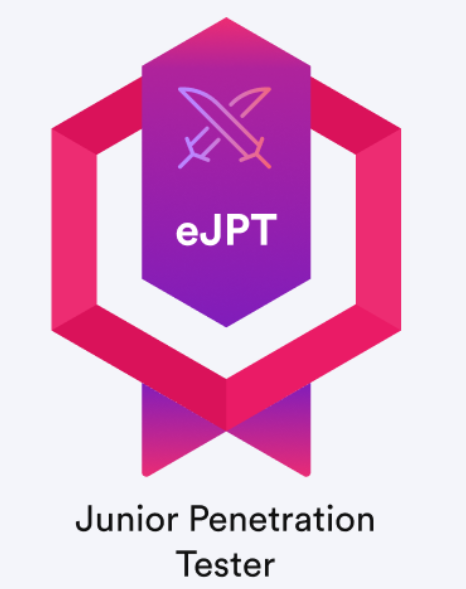
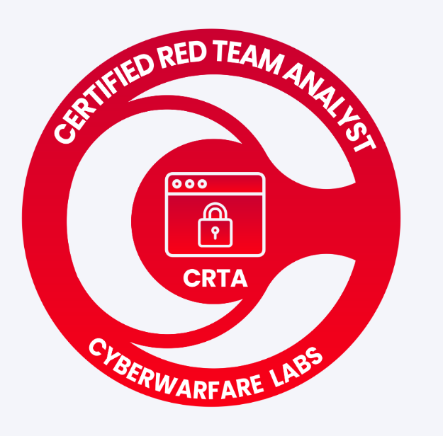

# About Me

    

## 👋 Hi there! I'm Arnav Tripathy

I am a **Cyber Security** and **DevOps Engineer** with a passion for building secure, scalable, and efficient systems. Here's a little more about me:

---

### 🌟 Highlights

- **🎓 Education**: Graduated from Vellore Institute of Technology in 2021 with a B.Tech in Computer Science and Engineering. Currently pursuing a **Master's Degree in Computer Science** at Trinity College Dublin.

- **💼 Professional Experience**:
  - [**Browserstack**](https://www.browserstack.com/): Security Software Engineer (2022 - 2024)
  - [**Cloudsek**](https://www.cloudsek.com/): Cyber Security Analyst and DevOps Engineer (2021 - 2022)

---

### 🛠️ Skills & Tools

#### **DevOps & Cloud**

#### **Programming & Scripting**

#### **Cyber Security specific*
- Application Security Testing
- DevSecOps Implementation
- Security automation
- Incident Response and malware analysis(basics but eager to work in)

---

### 💬 Reach Out To Me

- **📫 LinkedIn**: [Arnav Tripathy](https://in.linkedin.com/in/arnav-tripathy)
- **✍️ Medium**: [Arnav's Blog](https://arnavtripathy98.medium.com/)

---

### 📜 Certifications

Here are some of the certifications I've earned:

### ⚡ Fun Fact

I'm a travel enthusiast who enjoys exploring security and cloud and writing about them in my spare time! 😄

-  Singapore
-  Malaysia
-  United Arab Emirates (UAE)
-  Thailand
-  Vietnam
-  Hong Kong
-  Macau
-  Sri Lanka
-  Ireland

---
